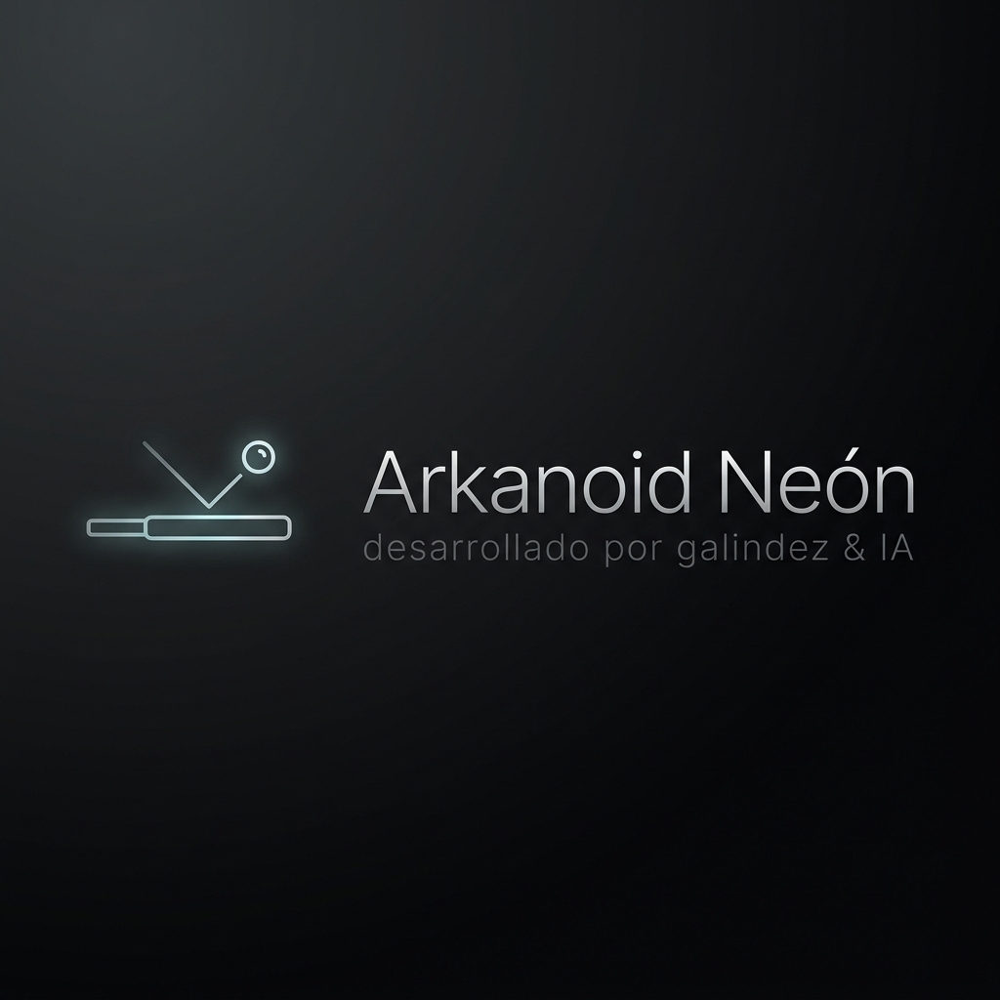

<div align="center">
  
  
  # 🧱 Arkanoid Neón
  
  **Un tributo cyberpunk moderno al clásico juego de romper bloques.**
  
  [**🎮 JUEGA AHORA EN VIVO**](https://juegoarkanoid-948774944187.europe-west1.run.app/)

</div>

---

## 🌟 Descripción

**Arkanoid Neón** reinventa el clásico rompeladrillos combinando un diseño de luces **cyberpunk** y *glassmorphism* con físicas precisas. Presenta controles responsivos para teclado, ratón y toques táctiles en móviles, brindando una experiencia rápida y envolvente.

El proyecto está diseñado utilizando animaciones suaves y el `<canvas>` nativo de HTML5 para cálculos de rebote y colisiones de forma rápida.

## 🚀 Arquitectura del Proyecto

El sistema está construido bajo los siguientes pilares tecnológicos y arquitectónicos:

- **Framework y UI**: 
  - Desarrollado como una *Single Page Application (SPA)*.
  - Basado en **React 19** y empaquetado con **Vite** para una carga ultrarrápida.
  - Tipado de datos estricto usando **TypeScript**.
  - Estilizado utilizando **Tailwind CSS V4** (configuración de neones personalizados vía utilidades arbitrarias).
  
- **Motor Gráfico y Logica**:
  - Un bucle de renderizado ajustado con `requestAnimationFrame` que interactúa con la API Canvas en 2D, optimizando la detección de colisiones de manera continua.
  
- **Infraestructura y Despliegue Automático (CI/CD)**:
  - Encontrándose desplegado en Google Cloud Run a través de **Google Cloud Build** (`cloudbuild.yaml`).
  - Utiliza un `Dockerfile` en configuración multietapa. Compilado con Node y servido configurado para el puerto `8080`.

## 🕹️ Cómo Jugar

1. **Escritorio**: Utiliza las **Flechas del Teclado** (`Izquierda`/`Derecha`), el **Ratón**, o las teclas **A y D** para mover tu plataforma. Presiona el botón principal, espacio o click para lanzar la bola inicial.
2. **Móviles**: Toca botones o arrastra para mover el paddle rápidamente y asegurar el rebote de la esfera de neón.
3. Rompe todos los bloques para avanzar ganando puntos sin dejar caer la bola fuera de los límites inferiores.

## ⚙️ Correr en Local (Desarrollo)

Siga estas instrucciones para preparar y probar el entorno de forma local:

**Requisitos Previos:** **Node.js** (versión 18+) y Git.

1. **Clonar e Ingresar al repositorio**:
   ```bash
   git clone https://github.com/tu-usuario/JuegoArkanoid.git
   cd JuegoArkanoid
   ```

2. **Instalar Dependencias**:
   ```bash
   npm install
   ```

3. **Ejecutar el Servidor de Desarrollo**:
   ```bash
   npm run dev
   ```

4. **Visualizar el Proyecto**:
   Abre la URL proporcionada en tu terminal (usualmente `http://localhost:5173`).

## 📜 Licencia y Créditos

Proyecto desarrollado por **Galindez & IA**.
